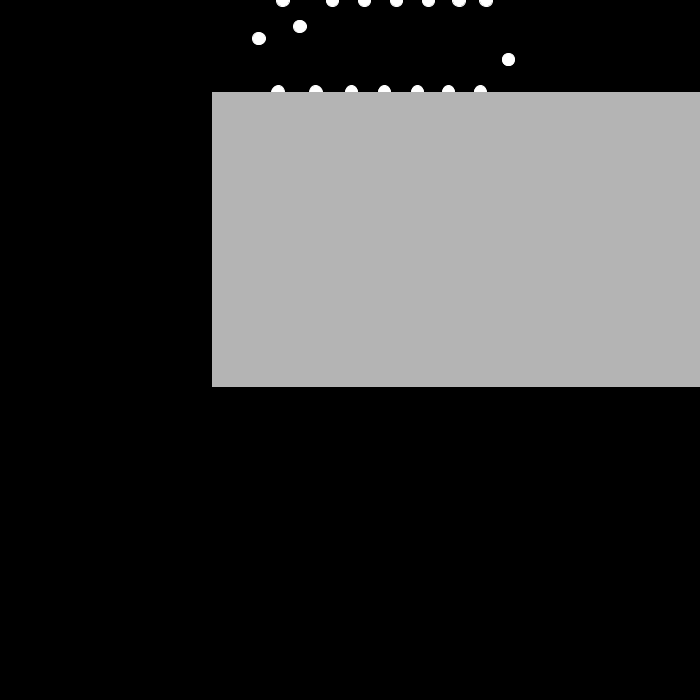

# Ressort
Simulation d'un amas de points tous relier entre eux par des ressorts

## Comment l'ouvrir et le lancer :

-Télécharger Processing 3 : https://processing.org/download/
-Ouvrir et lancer ressortt.pde avec Processing 3
